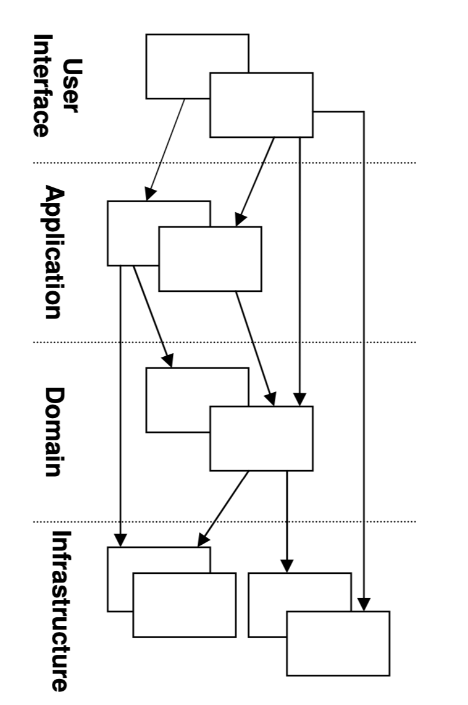

## Can Skip first four chapters

A typical interaction of the application, domain and infrastructure could look like this. The user wants to book a flights route, and asks an application service in the application layer to do so. The application tier fetches the relevant domain objects from the infrastructure and invokes relevant methods on them, e.g., to check security margins to other already booked flights. Once the domain objects have made all checks and updated their status to “decided”, the application service persists the objects to the infrastructure.

### <b>User Interface(Presentation Layer)</b>
Responsible for showing information to the user and interpreting the user's commands. The external actor might sometimes be another computer system rather than a human user
### <b>Application Layer</b>
Defines the jobs the software is supposed to do and directs the expressive domain object to work out problems. The tasks this layer is responsible for are meaningful to the business or necesary for interaction with the application layers of other systems. 
This layer is <b>`kept thin. It does not contain business rules or knowledge, but only coordinates tasks and delegates work to collaborations of domain objects in the next layer down`</b>. It does not have state relecting the business situation, but it can have state that reflects the progress of a taks for the user or the program.
### <b>Domain Layer(Model Layer)</b>
Reponsible for representing concepts of the business, information about the business situation, and business rules. State that reflects the business situation is controlled and used here, even though the technical details of storing it are delegated to the infrastructire. This layer is the hear of business software.
### <b>Infrastructure Layer</b>
Provides generic technical capabilities that support the higher layers: message sending for the application, persistence for the domain, drawing widgets for the UI, and so son. The infrastructure layer may also support architectural framework.

The infrastructure layer usually does not initiate action in the domian layer. Being "below" the domain layer, it should have no specific knowledge of the domain it is serving. Indeed, such technical capabilities are most often offered as `SERVICES`. For example, if an application needs to send an e-mail, some message-sending interface can be located in the infrastructure layer and the
application layer elements can request the transmission of the message. This decoupling gives
some extra versatility. The message-sending interface might be connected to an e-mail sender, a
fax sender, or whatever else is available. But the main benefit is simplifying the application layer,
keeping it narrowly focused on its job: knowing when to send a message, but not burdened with
how.

But not all infrastructure comes in the form of SERVICES callable from the higher layers. Some
technical components are designed to directly support the basic functions of other layers (such as
providing an abstract base class for all domain objects)

## C5
three
patterns of model elements that express the model: ENTITY, VALUE OBJECT, SERVICES

Does an object represent something with continuity and identity—something that is tracked
through different states or even across different implementations? Or is it an attribute that
describes the state of something else? This is the basic distinction between an ENTITY and a VALUE
OBJECT.

Then there are those aspects of the domain that are more clearly expressed as actions or
operations, rather than as objects. Although it is a slight departure from object-oriented modeling
tradition, it is often best to express these as SERVICES, rather than forcing responsibility for an
operation onto some ENTITY or VALUE OBJECT

bidirectional association -> unidirectional association 
Example: 
president <-> country is bidirectional, Pragmatically, we can reduce the relationship to a
unidirectional association, traversable from country to president. Add constraints even can make a 1-to-1 relationship
## Entities
An entity is a plain object that has an identity (ID) and is potentially mutable. Each entity is uniquely identified by an ID rather than by an attribute; therefore, two entities can be considered equal (identifier equality) if both of them have the same ID even though they have different attributes

## Value Objects
In DDD, value objects differ from entities by lacking the concept of identity. We do not care who they are but rather what they are. They are defined by their attributes and shohuld be immutable. Being immutable, and having no identity, Value Objects can be shared.

<b>When you care only about the attributes of an element of the model, classify it as a
VALUE OBJECT. Make it express the meaning of the attributes it conveys and give it
related functionality. Treat the VALUE OBJECT as immutable. Don't give it any identity
and avoid the design complexities necessary to maintain ENTITIES</b>

A VALUE OBJECT can be an assemblage of other objects. In software for designing house plans, an
object could be created for each window style. This "window style" could be incorporated into a
"window" object, along with height and width, as well as rules governing how these attributes can
be changed and combined. These windows are intricate VALUE OBJECTS made up of other VALUE
OBJECTS. They in turn would be incorporated into larger elements of a plan, such as "wall" objects

VALUE OBJECTS can even reference ENTITIES. For example, if I ask an online map service for a
scenic driving route from San Francisco to Los Angeles, it might derive a Route object linking L.A.
and San Francisco via the Pacific Coast Highway. That Route object would be a VALUE, even though
the three objects it references (two cities and a highway) are all ENTITIES.

## Service
A service is not about the object performing the service, but is related to the objects the operations are performed on/for. An object does not have an internal state, and its purpose is to simply provide functionality for the domain.
There are three characteristics of a Service:
1. The operation performed by the Service refers to a domain concept which does not naturally belong to an Entity or Value Object.
2. The operation performed refers to other objects in the domain.
3. The operation is stateless.

If the operation performed conceptually belongs to the application layer, then the Service should be placed there. If the operation is about domain objects, and is strictly related to the domain, serving a domain need, then it should belong to the domain layer.

## Modules
high level of cohesion and a low level of coupling(高内聚低耦合) 
Modules should be made up of elements which functionally or logically belong together assuring cohesion. Modules should have well defined interfaces which are accessed by other modules. Instead of calling three objects of a module, it is better to access one interface, because it reduces coupling.

## Aggregate
An Aggregate is a group of associated objects which are considered as one unit with regard to data changes. Each Aggregate has one root. The root is an Entity, and it is the only object accessible from outside. The root can hold references to any of the aggregate objects, and the other objects can hold references to each other, but an outside object can hold references only to the root object. Choose one Entity to be the root of each Aggregate, and control all access to the objects inside the boundary through the root.

## Factory
Entities and Aggregates can often be large and complex – too complex to create in the constructor of the root entity. There are times when a Factory is not needed, and a simple constructor is enough. Use a constructor when:
* The construction is not complicated.
* The creation of an object does not involve the creation of others, and all the attributes needed are passed via the constructor.
* The client is interested in the implementation, perhaps wants to choose the Strategy used.
* The class is the type. There is no hierarchy involved, so no need to choose between a list of concrete implementations.

## Repositories
In a nutshell, it is API between client and storage. A Repository may contain detailed information used to access the infrastructure, but its interface should be simple. A Repository should have a set of methods used to retrieve objects.