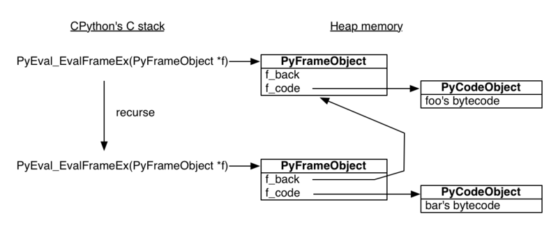

Python 的内存管理是通过私有 heap 完成的, 所有的一切都在 private heap 上 
函数通过 PyEval_EvalFrameEx 执行 并且创建一个 栈帧. 因为栈帧都是分配在堆内存上 堆内存的特点是你要你不去释放，就会一直存在内存当中。这就决定了栈帧可以独立于调用者存在

当python解释器看到一个 yield 会给函数一个生成器 标志 
在你调用生成器函数时 Python 看到标志 从而生成一个生成器 而不是运行函数

生成器对象主要封装了一个 堆栈帧 和一个对生成器 函数代码 的引用 
