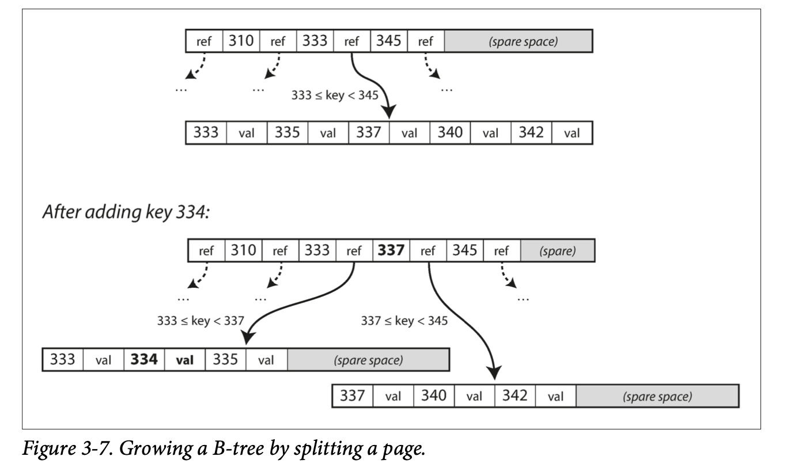
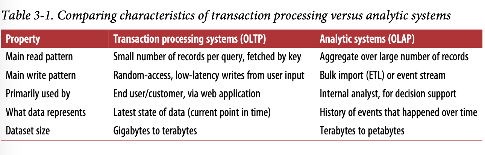

### Load
Load can be described with a few numbers which we call load parameters. The best choice of parameters depends on the architecture of your system: it may be requests per second to a web server, the ratio of reads to writes in a database, the number of simultaneously active users in a chat room, the hit rate on a cache, or something else. Perhaps the average case is what matters for you, or perhaps your bottleneck is dominated by a small number of extreme cases.

### Describing the performance
You can look at it in two ways:
* When you increase a load parameter and keep the system resources (CPU, mem‐ ory, network bandwidth, etc.) unchanged, how is the performance of your system affected?
* When you increase a load parameter, how much do you need to increase the resources if you want to keep performance unchanged?

### p50
If you take your list of response times and sort it from fastest to slowest, then the median is the halfway point. For example, if your median response time is 200 ms, that means half your requests return in less than 200 ms, and half your requests take longer than that.

### Abstraction 
Making a system simpler does not necessarily mean reducing its functionality; it can also mean removing accidental complexity. Moseley and Marks define complex‐ ity as accidental if it is not inherent in the problem that the software solves (as seen by the users) but arises only from the implementation.
One of the best tools we have for removing accidental complexity is abstraction. A good abstraction can hide a great deal of implementation detail behind a clean, simple-to-understand façade. A good abstraction can also be used for a wide range of different applications. Not only is this reuse more efficient than reimplementing a similar thing multiple times, but it also leads to higher-quality software, as quality improvements in the abstracted component benefit all applications that use it.
For example, high-level programming languages are abstractions that hide machine code, CPU registers, and syscalls.

### Declarative vs Imperative
```
function getSharks() { var sharks = [];
for (var i = 0; i < animals.length; i++) { if (animals[i].family === "Sharks") {
sharks.push(animals[i]); }
}
return sharks; }
```
An imperative language tells the computer to perform certain operations in a certain order.<br>
```
SELECT * FROM animals WHERE family = 'Sharks';
```
In a declarative query language, like SQL or relational algebra, you just specify the pattern of the data you want—what conditions the results must meet, and how you want the data to be transformed (e.g., sorted, grouped, and aggregated)—but not how to achieve that goal. It is up to the database system’s query optimizer to decide which indexes and which join methods to use, and in which order to execute various parts of the query.

### SSTables and LSM Tree
SSTables = Sorted String Tables
大致意思是 每个segment中的 key 唯一 并且有序
写入存储过程用平衡树保证有序
Merging several SSTable segments, retaining only the most recent value for each key.

LSM storage enginee用的是查找most recent segment然后most second recent segment
what happens in each segment? 假如你要读 handiwork你不知道offset, 但是你知道handbag和handsome,再加上有序,This means you can jump to the offset for handbag and scan from there until you find handiwork (or not, if the key is not present in the file.


Lucene, an indexing engine for full-text search used by Elasticsearch and Solr, uses a similar method for storing its term dictionary <br>
term dictionary: list of document id

性能优化-bloom filters 布隆过滤器 <br>
A Bloom filter is a memory-efficient data structure for approximating the contents of a set. It can tell you if a key does not appear in the database, and thus saves many unnecessary disk reads for nonexistent keys

### B-Tree
The log-structured indexes we saw earlier break the database down into variable-size segments, typically several megabytes or more in size, and always write a segment sequentially. By contrast, B-trees break the database down into fixed-size blocks or pages, traditionally 4 KB in size (sometimes bigger), and read or write one page at a time. This design corresponds more closely to the underlying hardware, as disks are also arranged in fixed-size blocks.<br>
The number of references to child pages in one page of the B-tree is called the branching factor
```
| ref | 100 | ref | 200 | ref | 300 | ref | 400 | ref | 500 | ref |
The branching factor is 6
```
In practice, the branching factor depends on the amount of space required to store the page refer‐ ences and the range boundaries, but typically it is several hundred.<br>
If you want to add a new key, you need to find the page whose range encompasses the new key and add it to that page. If there isn’t enough free space in the page to accommodate the new key, it is split into two half-full pages, and the parent page is updated to account for the new subdi‐ vision of key ranges

Most databases can fit into a B-tree that is three or four levels deep, so you don’t need to follow many page references to find the page you are look‐ ing for. (A four-level tree of 4 KB pages with a branching factor of 500 can store up to 256 TB.)

### B-tree optimizations
WAL (write-ahead log) - This is an append-only file to which every B-tree modification must be written before it can be applied to the pages of the tree itself. When the data‐ base comes back up after a crash, this log is used to restore the B-tree back to a con‐ sistent state<br>


latches (lightweight locks) - Protect tree's data structures from concurrent updating on pages

### Write Amplification
one write to the database resulting in multiple writes to the disk over the course of the database’s lifetime—is known as write amplification.<br>
Write amplification (WA) is an undesirable phenomenon associated with flash memory and solid-state drives (SSDs), where the actual amount of information physically-written to the storage media is a multiple of the logical amount intended to be written.

### Other index tech
The key in an index is the thing that queries search for, but the value can be one of two things: it could be the actual row (document, vertex) in question, or it could be a reference to the row stored elsewhere. In the latter case, the place where rows are stored is known as a heap file.<br>
When updating a value without changing the key, the heap file approach can be quite efficient<br>
In some situations, the extra hop from the index to the heap file is too much of a per‐ formance penalty for reads, so it can be desirable to store the indexed row directly within an index. This is known as a clustered index<br>
A compromise between a clustered index (storing all row data within the index) and a nonclustered index (storing only references to the data within the index) is known as a covering index or index with included columns, which stores some of a table’s col‐ umns within the index <br>

http://www.mathcs.emory.edu/~cheung/Courses/554/Syllabus/3-index/R-tree.html
R-tree


https://tech.meituan.com/2014/06/30/mysql-index.html
mysql 文章 就结论简单来说最左匹配 遇到 "<" or ">"就不使用索引了


### OLTP & OLAP
online transaction processing<br>
online analytic processing<br>

At first, the same databases were used for both transaction processing and analytic queries. SQL turned out to be quite flexible in this regard: it works well for OLTP- type queries as well as OLAP-type queries. Nevertheless, in the late 1980s and early 1990s, there was a trend for companies to stop using their OLTP systems for analytics purposes, and to run the analytics on a separate database instead. This separate data‐ base was called a data warehouse.